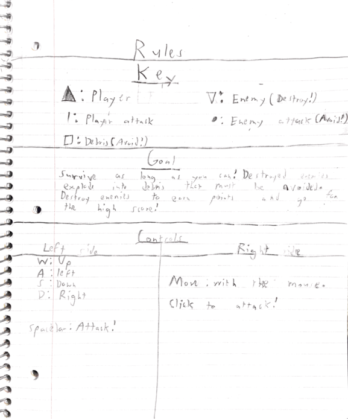

# **United**

## I. High Concept

Two bullet hell games, *at the same time.*

## II. Genre
  * Gameplay 
    * Shooter
    * Top Down
  * IGN 
    * Action
    * Arcade
    * Shooter

## III. Platform

Desktop only, the control scheme and screen size would not work well on mobile. 

## III. Story

Two neighboring planets are under attack from alien armadas. They must defend themselves using their own space ships to destroy the attacking enemies. If either planets defender falls, both planets are doomed. But there are dangers to fighting together: each defender can get caught in the cross-fire from the others fight, as debris and projectiles cross the divider between the two “games” and threaten the other side. A single player must pay close attention to both halves of the screen while controlling two ships and fighting in two directions at the same time, avoiding attacks and surviving as long as possible while destorying invaders to earn points.

## IV. Graphics

*United* will comprise of simple geometry and shapes, with solid triangles representing the players and clear triangles representing enemies. Player projectiles will be straight lines, enemy projectiles will be small circles. Debris created by destroyed enemies will be squares. The UI will be simple and unintrusive. 

## V. Sound

*United* will either have fast paced, energetic background music, or none at all. Sound effects will consist of sci-fi lasers and explosions to match the action. 

## VI.Gameplay

### Mechanics 

* The player will control two ships at the same time, one on the bottom left and one on the top right of the screen. The two halves of the screen will be seperated by a vertical line, which the player cannot cross. Enemies will come from the top left and bottom right, and must be destroyed for points. These enemies will attack the player by shooting projectiles that must be dodged. Destroyed enemies will reward points, but also explode into debris that will travel at an angle onto the other half of the screen, requiring the player to be aware of the destruction they cause on either side. If either player ship is hit, the player loses. 

### Controls 

* Keyboard (wasd) for left side movement, spacebar to attack.
* Mouse for right side movement, click to attack. 
* Mouse used to navigate menus. 

### Onboarding 

* There will be a simple instruction screen, but overall the game is self-explanatory 

### Player Learning 

* Because the game uses a high score system rather than preset levels, it is not actually "beatable". As a result, player skill and knowledge will come from repeated play sessions as they become familiar with the controls and the need to focus on two things at once. 

## VII.Screenshots 

## VIII. About the Developers
Matthew Sze-Tu is a second year Game Design and Development Major with experience in C#, Javascript, Python, HTML, and CSS. When he isn't coding or working on his various school assignments, he enjoys reading Shakespeare, writing character designs and RP's, and playing a variety of Video Games in the name of "research". 

